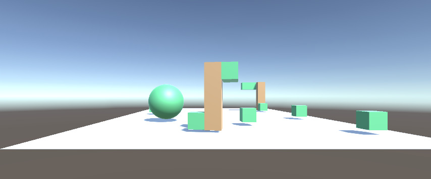
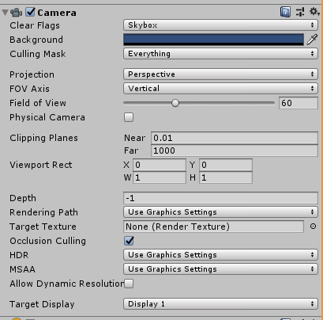
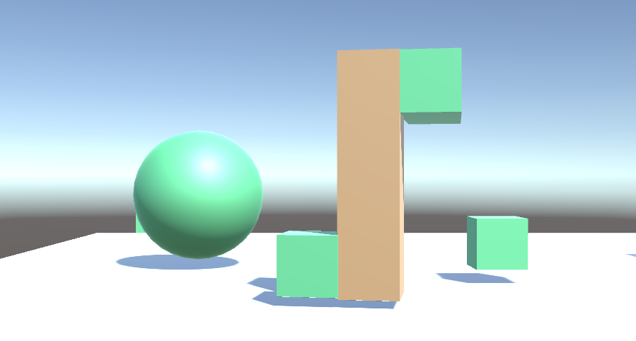
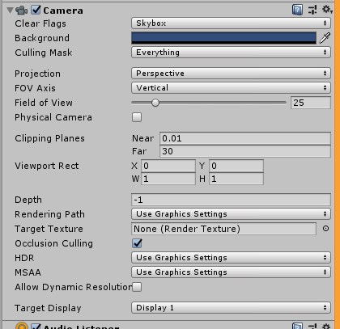
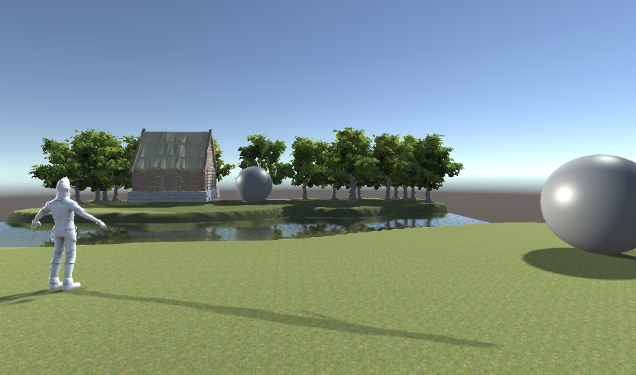
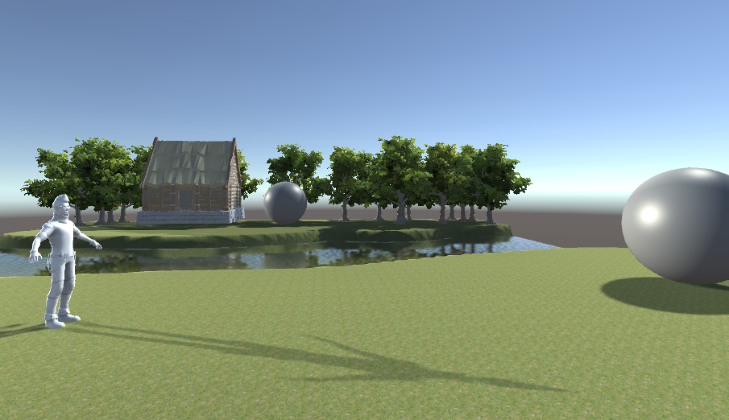

# Mundos virtuales. Introducción a la programación de gráficos 3D.
## **Autor**: Florentín Pérez González.

---

## 1. ¿Qué funciones se pueden usar en los scripts de Unity para llevar a cabo traslaciones, rotaciones y escalados?

En Unity se puede usar el objeto Transform para aplicar las operaciones deseadas. En concreto, si se desea llevar a cabo una traslación se usaría la función `transform.Translate()`; rotar con `transform.Rotate()`, y escalar a través de la modificación del valor del parámetro público `Transform.localScale`.

---

## 2. ¿Cómo duplicarías el tamaño de un objeto en en un script?.

Es necesario recurrir al parámetro  `Transform.localScale`. En concreto, lo necesario es cambiar su componente **Y** por el doble de su valor base.
```c#
transform.localScale = new Vector3(transform.localScale.x, transform.localScale.y * 2, transform.localScale.y);
```

---

## 3. ¿Cómo situarías un objeto en la posición (3,5,1.)?

En lugar de recurrir a la función `transform.Translate()`, modificamos directamente las componentes que definen la posición del objeto, contenidas en el parámetro **position**.

```c#
transform.position = new Vector3(3, 5, 1);
```

---

## 4. ¿Como trasladarías 3 metros en cada uno de los ejes y luego lo rotas 30º alrededor del eje Y?

Se debería emplear una combinación de `transform.Translate()` y `transform.Rotate()`. En primera instancia, aumentamos el desplazamiento en cada posición 3 metros y luego rotamos en función eje Y en con respecto al sistema de coordenadas local al objeto.

```c#
transform.Translate(new Vector3(3, 3, 3));
transform.Rotate(0.0f, 30.0f, 0.0f, Space.Self);
```

---

## 5. ¿Cómo rotarías un objeto sobre el eje (1,1,1)?

La función `transform.Rotate()` está sobrecargada y una de sus expresiones permite expresar el eje sobre el cual se desea rotar.

```c#
transform.Rotate(/*Angulo*/30.0f, new Vector3(1, 1, 1), Space.Self);
```
---

## 6. Rota un objeto alrededor del eje Y 30ª y desplázalo 3 metros en cada uno de los ejes. ¿Obtendrías el mismo resultado que en 4?

Realizamos los mismos pasos que en el ejercicio 4, pero alternando el orden de las llamadas a funciones.

```c#
transform.Rotate(0.0f, 30.0f, 0.0f, Space.Self);
transform.Translate(new Vector3(3, 3, 3));
```

El resultado que se obtendría dependería complementamente de con que respecto a que sistema de coordenadas se realiza la translación. Si la translación se realiza respecto al sistema del objeto, tal y como está especificado tanto en el punto 4 como en el 6, entonces el resultado que se obtendría sí sería distinto, pues la rotación cambiaría la orientación de los ejes.

<p align="center">

</p>

## 7. ¿Cómo puedes obtener la distancia al plano cerca del volumen de vista desde la cámara

La distancia al plano cerca está recogida como un atributo dentro del objeto Camera correspondiente. Este atributo recibe el nombre de `nearClipPlane`.

---

## 8. ¿Cómo puedes aumentar el ángulo de la cámara?

El ángulo de la camera es una propiedad de los objectos Camera. Su nombre es `fieldOfView` y su valor se expresa en grados. Por tanto, para aumentar su valor basta con modificarlo como cualquier otra variable.

## 9. ¿Qué efecto tiene disminuir el ángulo de la cámara?

Disminuir el ángulo de la cámara provoca que el volumen de vista vea reducido sus dimensiones, lo que a efectos prácticos disminuye la perspectiva dando la sensación de que los objetos que se visualizan se encuentran más cerca de la camara de lo que realmente están, simulando en cierta menera el efecto de *hacer zoom*.

---

## 10. Configura un volumen de vista que recorte objetos de la escena.
Primero, se mostrara el visionado de la escena por la cámara con la configuración estándar.

<p align="center">

</p>

<p align="center">

</p>

A continuación, se mostrará el visionado con las ajustes realizados.

<p align="center">

</p>

<p align="center">

</p>

## 11. ¿Cómo puedes realizar la proyección al espacio 2D?

Para realizar una transformación del sistema de referencia mundial a un punto 2D de la pantalla puede utilizarse el método `Camera.WorldToScreenPoint`.

```c#
Vector3 screenPos = cam.WorldToScreenPoint(target.position);
Debug.Log("target is " + screenPos.x + " pixels from the left");
```

---

## 12. Especifica la rotación de los apartados 4 y 6 con la utilidad quaternion.

La propiedad `Transform.rotation` es en sí misma un Quaternion, por lo que para realizar las transformaciones deseadas bastaría con modificar su valor.
Para el apartado 4:
```c#
transform.Translate(new Vector3(3, 3, 3));
transform.rotation = Quaternion.Euler(0, 30, 0);
```
Para el apartado 6:
```c#
transform.rotation = Quaternion.Euler(0, 30, 0);
transform.Translate(new Vector3(3, 3, 3));
```

---

## 13. ¿Como puedes averiguar la matriz de proyección en perspectiva que se ha usado para proyectar la escena al último frame renderizado?.

A través del atributo `Camera.previousViewProjectionMatrix`. En concreto, devuelve un objeto `Matrix4x4`.

## 14. ¿Como puedes averiguar la matriz de proyección en perspectiva ortográfica que se ha usado para proyectar la escena al último frame renderizado?.

Harían dos opciones. La primera consistiría en especificar que la camara es ortográfica y obtener la matriz de proyección tal y como se hizo en el apartado anterior.
```c#
Camera.main.orthographic = true;
Matrix4x4 matrix = Camera.main.previousViewProjectionMatrix;
```
La otra opción, consistiría en obtenerla a partir de la proyección en perspectiva no ortográfica.
```c#
Matrix4x4 matrix = GL.GetGPUProjectionMatrix(Camera.main.previousViewProjectionMatrix, false);
```

---

## 15. ¿Cómo puedes obtener la matriz de transformación entre el sistema de coordenadas local y el mundial?.

Se trata de una propiedad de solo lectura de la clase `Transform`. Recibe el nombre de `Transform.localToWorldMatrix` y se trata de un objeto `Matrix4x4`.
A su vez, también se puede obtener la matrix que realiza la transformación opuesta. Recibe el nombre de `Transform.worldToLocalMatrix`

---

## 16. ¿Cómo puedes obtener la matriz para cambiar al sistema de referencia de vista?

La matrix correspondiente se trata de una propiedad que se encuentra en los objetos `Camera`. Recibe el nombre `Camera.worldToCameraMatrix` y se trata de un objeto `Matrix4x4`.

---

## 17. Especifica la matriz de la proyección usado en un instante de la ejecución del ejercicio 1 de la práctica 1.

La matriz de proyección obtenida ha sido:
```c#
-0.22489	0.00000	    -2.37884	96.81729
0.00000	    -3.75828	0.00000	    49.23342
-0.00030	0.00000	    0.00003	    0.29511
0.99556	    0.00000	    -0.09412	16.58720
```

El instante correspondiente ha sido el siguiente:

<p align="center">

</p>

## 18. Especifica la matriz de modelo y vista de la escena del ejercicio 1 de la práctica 1.

La matriz de modelo de la cámara es:
```c#
-0.22489	0.00000	    -2.37884	96.81729
0.00000	    -3.75828	0.00000	    49.23342
-0.00030	0.00000	    0.00003	    0.29511
0.99556	    0.00000	    -0.09412	16.58720
```

Por su parte, la matriz de vista es:
```c#
-0.22489	0.00000	    -2.37884	96.81729
0.00000	    -3.75828	0.00000	    49.23342
-0.00030	0.00000	    0.00003	    0.29511
0.99556	    0.00000	    -0.09412	16.58720
```
La escena sobre la que se ha trabajado es la misma que para el apartado anterior.

---

## 19. Aplica una rotación en el start de uno de los objetos de la escena y muestra la matriz de cambio al sistema de referencias mundial.

Se ha aplicado una rotación de 90º al personaje de Ethan resultando en la escena que se muestra en la imagen. La matrix correspondiente es:

```c#
-4.95208	0.02184	    -0.69022	13.90000
0.02212	    4.99995	    -0.00053	5.00000
0.69022	    -0.00358	-4.95213	57.40000
0.00000	    0.00000	    0.00000	    1.00000
```

<p align="center">

</p>

---

## 20. ¿Cómo puedes calcular las coordenadas del sistema de referencia de un objeto con las siguientes propiedades del Transform:?: Position (3, 1, 1), Rotation (45, 0, 45)

Creamos un objeto y le asignamos la posición y rotación especificada. Posteriormente, para obtener las coordenadas del sistema de referencia local usaremos la matriz definida en `transform` `Transform.worldToLocalMatrix` para obtener las coordenadas del sistema de referencia. En dicha matriz la última columna, salvo la componente final que hace referencia al sistema homogéneo, indica las coordenadas del sistema de referencia. Estas podrían ser recuperadas a través de `Vector3`.

```c#
Matrix4x4 matrix = Transform.worldToLocalMatrix;
Vector3 position = new Vector3(matrix[0,3], matrix[1,3], matrix[2,3]);
```
